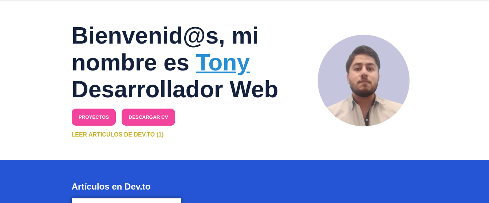
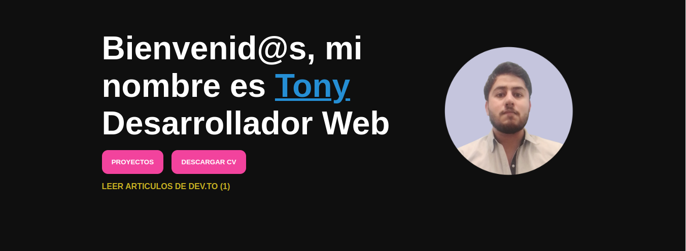

# Blog personal DEV.to

  <h1>Blog Dev.to</h1>
  <strong>Documentación del proyecto y marcos de trabajo que se utilizan</strong> 
  <strong>Dev.to</strong>

 

## Simple Blog

Es un consulta sencilla a la api : https://dev.to/api/articles?username=${user}
cambio de estado con tema oscuro.
 

### 🏗 Equipo de Ingeniería  

- [@T0ny-dev](https://github.com/T0ny-dev)

### 👨‍💻 Listados de marcos de trabajo

* React
* Vite
* Styled-Components

### 🗎 descargar de proyecto 

* para descargar `git clone`
* Ejecutar en su navegador 

### 🗎 Deploy 

### 🗎 Capturas del proyecto

